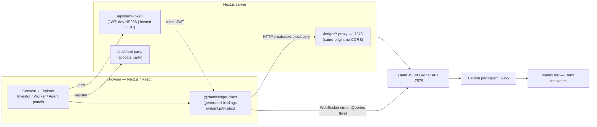
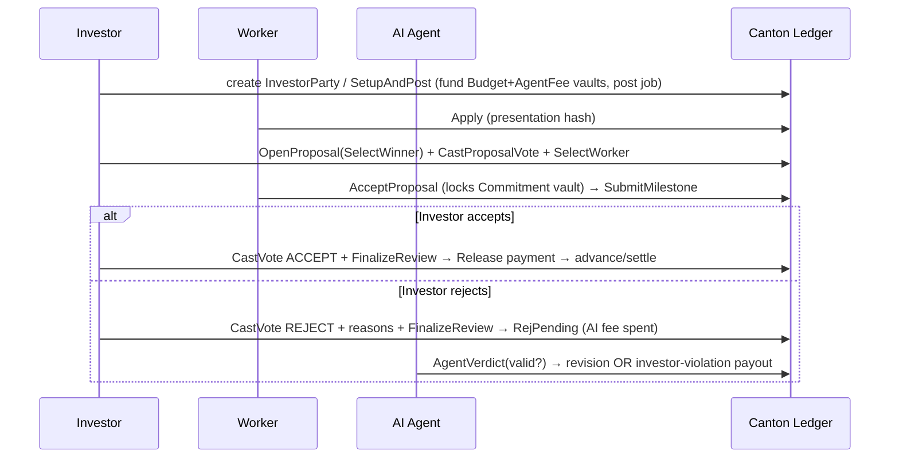

# Verdix — Completion Report

A **Canton-native** AI-governed freelance escrow platform. Daml contracts on a Canton
participant; a Next.js/React frontend that talks to the **Daml JSON Ledger API** via
`@daml/ledger` (no EVM, no Wagmi/Viem — those cannot reach Canton).

## Verification Results (evidence)

| Check | Result |
|---|---|
| `daml build` | ✅ DAR built (`vindex-0.1.0.dar`) |
| `daml test` (in-memory engine) | ✅ 8/8 scripts pass |
| **Workflow suite on the LIVE Canton ledger** (`daml script` → sandbox `:6865`) | ✅ **7/7 scenarios pass** |
| `@daml/ledger` create + query round-trip vs live JSON API | ✅ InvestorParty created + read back |
| JSON API HTTP query with real party JWT | ✅ HTTP 200 |
| Frontend `next build` | ✅ compiles (`/app`, `/app/explorer`, `/api/daml-token`, `/api/daml-party`) |
| Live UI connect (browser → participant) | ✅ "Participant online", streams live contracts |
| Live UI write (`SetupAndPost` exercise) | ✅ "Committed on-ledger" → `BudgetV 4000.0` + `AgentFeeV 300.0` streamed back |
| Hydration / hooks / CORS errors | ✅ 0 |

Live-ledger scenario scripts (each runs real command submission against the participant):

```
PASS  testHappyPathMulti          (Scenario 1 + multi-investor formation & voting)
PASS  testValidRejectionRevision  (Scenario 2 — valid rejection → revision)
PASS  testInvestorViolation       (Scenario 2 — invalid rejection → AI enforces payout)
PASS  testWorkerViolationStop     (Scenario 3 — deadline → penalty → governance stop)
PASS  testVotingModels            (Scenario 4 — simple / super / weighted thresholds)
PASS  testOverfundRejected        (escrow overfund guard)
PASS  testAgentFreezeThenTopUp    (dispute-only AI fee + freeze/top-up)
7/7 on the live Canton ledger
```

## Architecture



## User Flows



## Implemented Features

**Canton integration** — Daml Ledger API via `@daml/ledger`: command submission
(`create`/`exercise`), contract queries, **websocket streaming** (live ACS), real-time updates,
auto-reconnect, network/liveness detection (proxied `/readyz`).

**Auth / party** — party authentication via JWT (`/api/daml-token`, dev HS256 + hosted OIDC
client-credentials path), session management (localStorage + auto-reconnect), role management,
role→party mapping, **real party allocation/registration** (`/api/daml-party`).

**Investor** — create Investor Party, fund Budget + Agent-Fee vaults & post job (`SetupAndPost`,
overfund guard), vote Accept/Reject (`CastVote`), finalize review (`FinalizeReview`), live vault/
project/settlement views.

**Worker** — view postings, apply, accept proposal (deposit commitment), submit milestone,
track escrow/payments/settlements.

**AI Agent (dispute-only)** — verdict on disputes (`AgentVerdict`: valid → revision, invalid →
investor-violation + payout), enforcement (`WorkerViolation`). Not invoked on the happy path.

**Governance** — single/multi-investor parties, invite/accept, voting models (simple / super /
weighted) with quorum, governance proposals — enforced in the Daml contracts.

**Explorer** — live transparency dashboard streaming every template (parties, postings, projects,
milestones, vaults, proposals, reviews, AI disputes, settlements).

## Tested Features

- Escrow, milestone, governance, AI-dispute, payment-release, violation logic — **Daml Script**
  (`daml test`, 8 scripts) **and** re-run on the **live** ledger (`daml script`, 7 scenarios).
- Frontend client path — `@daml/ledger` create+query (Node) and live browser connect + stream +
  write (Playwright), including hydration/CORS/hooks regression checks (all clean).

## Remaining Issues / Honest Next Steps

- **OIDC**: the token endpoint implements the hosted OIDC client-credentials exchange, but a full
  external IdP login UI is not wired for the local demo (local uses Canton-native dev JWT auth).
- **Multi-investor UI**: the invite/accept + governance-proposal **contracts** are complete and
  pass on the live ledger; the UI currently exposes party-of-one creation + milestone voting.
  Inviting members and the SelectWinner/continue-stop/top-up proposal forms are a UI add (same
  `exercise` pattern already used).
- **Scenario 3 in-browser** needs ledger time advance; it's proven via `daml script` (static time).
  For a wall-clock UI demo, configure short worker windows.
- No EVM "block confirmations / explorer links" — Canton has none; the UI shows real contract/
  update ids instead.
- Frontend component unit tests (jest) not added; coverage is via live integration + Playwright.

See [DEMO.md](DEMO.md) for the exact bring-up + live walkthrough.
