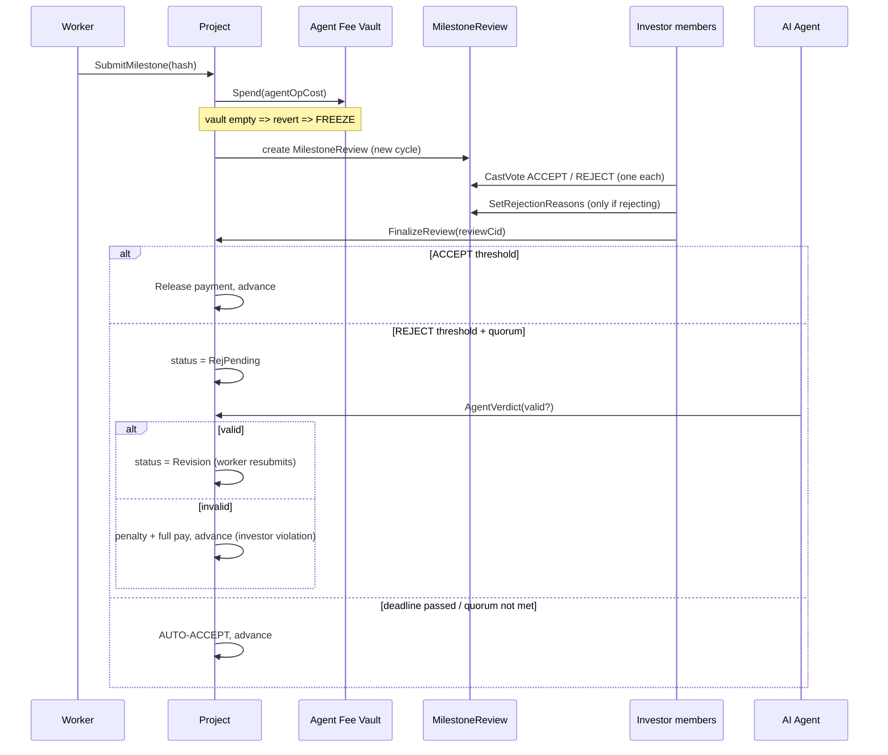

# Vindex — State Machine & Governance

## Milestone lifecycle (`stateDiagram-v2`)

```mermaid
stateDiagram-v2
    [*] --> Active : AcceptProposal (worker locks Commitment Vault)

    Active --> Submitted : SubmitMilestone (spend 1 Agent op; FREEZE if vault empty)
    Revision --> Submitted : SubmitMilestone (new voting cycle)

    Submitted --> Accepted : FinalizeReview / ACCEPT threshold reached
    Submitted --> Accepted : FinalizeReview / AUTO-ACCEPT (deadline, inactivity, quorum not met)
    Submitted --> RejPending : FinalizeReview / REJECT threshold + quorum (reasons recorded)

    RejPending --> Revision : AgentVerdict valid=True (worker revises)
    RejPending --> Accepted : AgentVerdict valid=False (INVESTOR violation: penalty + full pay)

    Active --> Failed : WorkerViolation (worker deadline missed; penalty from Commitment)
    Submitted --> Failed : WorkerViolation
    Revision --> Failed : WorkerViolation

    Accepted --> Active : advance (next milestone, reset count, recompute deadline)
    Accepted --> Completed : advance (final milestone => settle + refund)

    Failed --> Active : ResolveAfterViolation / ResolveContinue
    Failed --> Completed : ResolveAfterViolation / ResolveStop (settle + refund)

    Completed --> [*]
```

> Open risk: there is **no `agentVerdictDeadline`** — while `RejPending`, if the Agent never
> rules, the project stalls permanently (documented, not silently fixed).

## Review voting cycle (sequence)

## Transition table (choice → controller → guard → effect)

| Choice | Controller | Guard | Effect (incl. money movement) |
|---|---|---|---|
| `InviteInvestor` | admin | capacity, not already member | create `InvestorInvite` |
| `AcceptInvite` | invitee | not member, capacity, party matches | archive + recreate `InvestorParty` with new member |
| `SetupAndPost` | admin | milestones non-empty; **budget ≥ Σ payment·(1+p)** | create Budget + Agent Fee vaults, `ProjectPosting` |
| `Apply` | applicant | applicant ∈ candidates | create private `Application` |
| `OpenProposal` | admin | — | create `GovernanceProposal` |
| `CastProposalVote` | voter | member, not voted | append vote |
| `SelectWorker` | actor (member) | proposal passed, winner == applicant | create `ProjectProposal` |
| `AcceptProposal` | worker | milestones non-empty | **lock Commitment Vault**, create `Project` (Active) |
| `SubmitMilestone` | worker | Active/Revision, count<max, deadline ok | **Spend Agent op** (freeze if empty), create `MilestoneReview`, status Submitted |
| `CastVote` | voter | member, not voted this cycle | append vote |
| `SetRejectionReasons` | actor (member) | member, reasons non-empty | set structured reasons |
| `FinalizeReview` | actor (member) | status Submitted | ACCEPT/AUTO-ACCEPT → **Release + advance**; REJECT+quorum → RejPending |
| `AgentVerdict` | agent | status RejPending | valid → Revision; invalid → **penalty + full pay**, advance (investor violation) |
| `WorkerViolation` | member/agent | deadline passed, open milestone | **penalty from Commitment (capped)**, status Failed |
| `ResolveAfterViolation` | actor (member) | status Failed, proposal passed | Continue → advance; Stop → **settle + refund** |
| `TopUpAgentFee` | actor (member) | proposal passed (TopUp) | **TopUp Agent Fee Vault** (unfreeze) |
| `Release`/`Spend`/`TopUp`/`Settle` | vault funders | sufficient funds | **the only money-movement primitives** (Canton Token Standard swap point) |
